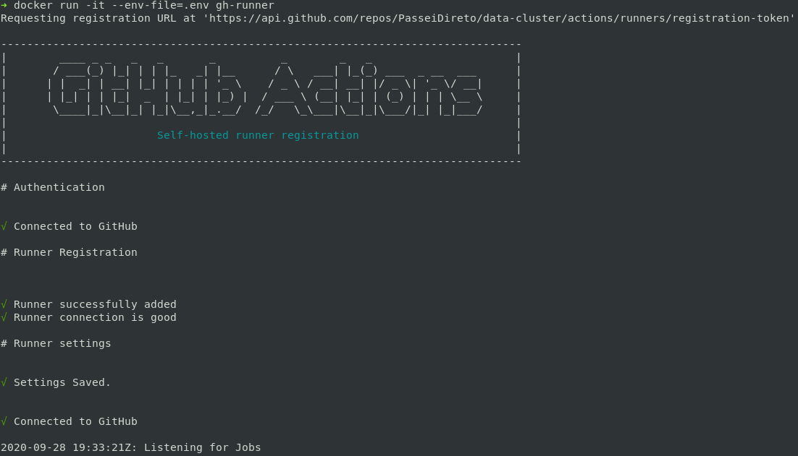

# GitHub Actions Runner

Self hosted GitHub Actions Runner.

O GitHub Actions permite a [configuração de instâncias dedicadas](https://docs.github.com/en/free-pro-team@latest/actions/hosting-your-own-runners/about-self-hosted-runners) para a execução das pipelines. Este projeto consiste em uma imagem docker que configura, executa e [registra](https://docs.github.com/en/free-pro-team@latest/actions/hosting-your-own-runners/adding-self-hosted-runners) um runner dedicado para determinado projeto ou organização dentro de um container Docker.

**Vantagens** do uso de runners dedicados:
1. Os minutos de execução pipeline não são cobrados.
1. Você pode registrar dependências específicas que não são destruídas depois de cada execução
1. Aderência a requisitos especiais de segurança e caching.


**Desvantagens** do uso de runners dedicados:
1. Não é possível executar comandos Docker
1. Interferência entre a execução de diferentes pipelines (instalação de dependências, por exemplo)
1. Apesar do runner ser atualizado automaticamente pelo GitHub, todas as outras dependências não são
1. Não é possível [desligar todos os runners quando estão ociosos](https://sanderknape.com/2020/03/self-hosted-github-actions-runner-kubernetes/)

## Funcionalidades
1. Personalização de hostname e registro em repositórios ou organizações
1. Remoção do runner quando o container é parado
1. Execução de vários runners no mesmo host (com ou sem autoscaling)
1. Kubernetes Ready

## Utilização
* Copie e configure o arquivo de exemplo de configuração. Você precisará de um [token de acesso](https://github.com/settings/tokens).
```sh
cp .env-exemple .env
```
* Faça o build da imagem
```sh
docker build . -t gh-runner
```
* Execute o runner:
```sh
docker run --env-file=.env gh-runner
```
* Aguarde a criação e o registro do container. Pronto! Você deve ver a seguinte saída no Terminal:



Para ver o(s) runner(s) registrado(s) no repositório, é só acessar `projeto > configurações > actions`:


Ao parar/matar o container, o runners será removido antes de terminar o processo:


**Importante!** Para configurar o runner na organização, basta deixar a variável `GITHUB_OWNER` vazia. Mas para isso você precisa de privilégios de administrador na organização alvo.

## Varáveis de Ambiente

| Variável | Descrição |
|----------|-----------|
|RUNNER_NAME| Nome de registro do container. O container ID será concatenado no final do nome escolhido para garantir unicidade.|
|GITHUB_PERSONAL_TOKEN| Seu token pessoal (ou do bot)|
|GITHUB_OWNER| Nome da organização (e.g. PasseiDireto|
|GITHUB_REPOSITORY|Repositório de registro (opcional)|
|RUNNER_WORKDIR|pasta de output do container padrão `_work`. Pode ser alterada por requisitos de espaço em disco, por exemplo.|

## Próximos Passos

1. Automação da arquitetura para deploy do host EC2/Fargate/ECS.
1. Estudar o formato com k8s + Helm [desse projeto](https://github.com/evryfs/github-actions-runner-operator) e discutir como as abordagens se complementam/competem. 

